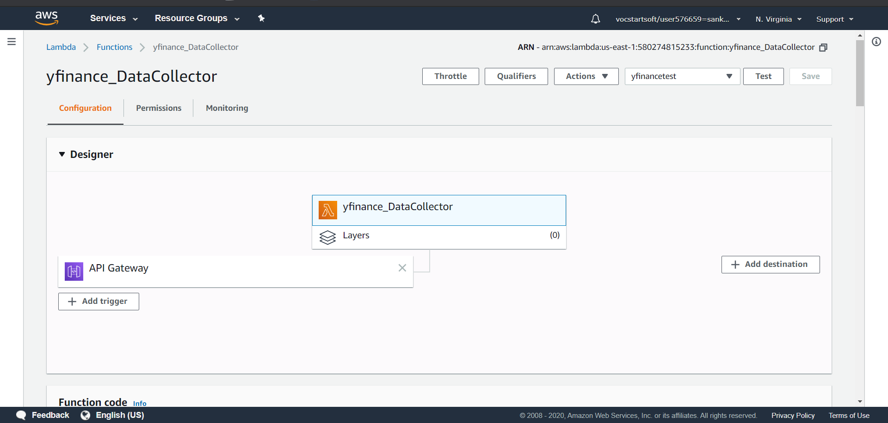
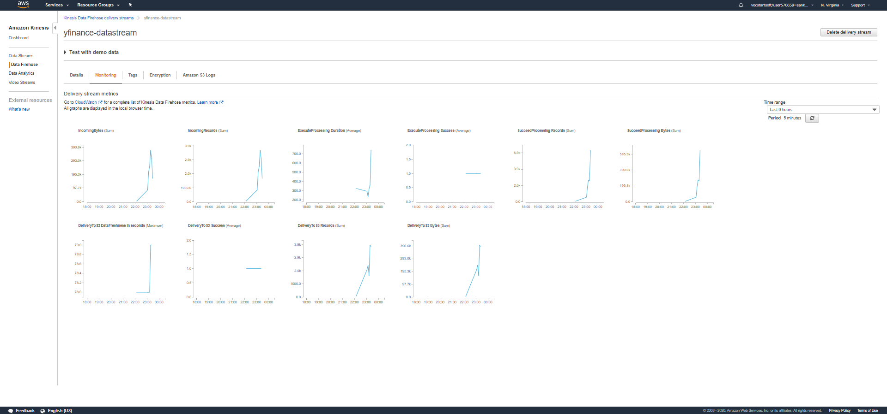

# YahooFinance_DataStreamnig-Analysis

In this project, we are leveraging the four of AWS services:
1. AWS Lambda (Data Collection and Transformation)
2. AWS Kinesis (Firehose) (Data Streaming)
3. AWS S3 Buckets (Data Storage)
4. AWS Glue & Athena (Querying Data)

### AWS Lambda

API Link: [Click to Trigger Lambda Function](https://l6ziaw192j.execute-api.us-east-1.amazonaws.com/default/yfinance_DataCollector)

**data_collector.py** is the python code for lambda function to call for historical stock prices for predefined companies and date.

Lambda Configuration:

### AWS Kinesis Monitoring

### AWS Athena & Glue

**query.sql** is the SQL query used to obtain the highest prices per hour for each company and the instances it reached highest hourly price

**results.csv** is the resulting dataset of the above query
